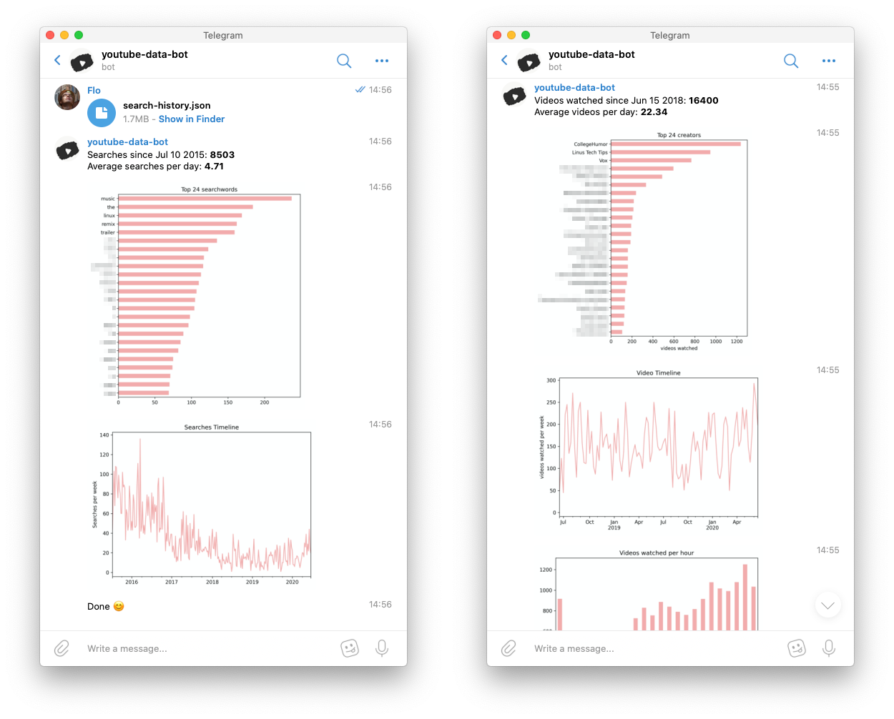

# youtube-data
Jupyter Notebook to analyse your youtube data.

## Screenshot

The notebook can do more than just tell you what creators you watch the most, so just try it out.

## Get started
### Requirements
1) Install jupyter lab [Website](https://jupyter.org/install.html)
2) Add the ipywidgets extension to jupyter lab [Website](https://github.com/jupyter-widgets/ipywidgets#install)
3) Install python libaries used for this notebook `pip install pandas numpy matplotlib ipywidgets`

### Run the notebook
1) Download your youtube data (and select Format=JSON) [Website](https://takeout.google.com/)
2) Copy the folder "Takeout" into the folder with the Notebook. (Note: I just got a notice that this only works if your language is set to english. If that is not the case you need to modify the path in the first code-cell. This bug will be fixed in the next commits.)
3) Run the notebook with `jupyter lab PATH-TO-NOTEBOOK`
